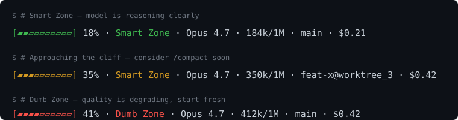

# Context Bart

[](https://github.com/alejandrok5/context-bart/actions/workflows/ci.yml)
[](https://www.npmjs.com/package/context-bart)
[](https://www.npmjs.com/package/context-bart)
[](LICENSE)

> A Smart Zone / Dumb Zone context-window meter for Claude Code, OpenCode, Codex, and other AI coding agents.




When you're talking to a long-context model, the first ~30% of the window is the **Smart Zone**, the model reasons reliably, follows instructions, and doesn't hallucinate. Push past ~40% and you enter the **Dumb Zone**: attention fragments, instructions get dropped, and "lost-in-the-middle" failures climb. `context-bart` puts that threshold front-and-center in your terminal so you know when to `/compact` or start a fresh session before quality degrades.

## Features

- **Single-line meter**: with a 10-segment progress bar, percentage, and zone label.
- **Color tiers**: green (0–29%), yellow (30–39%), red (40%+). Honors `NO_COLOR`.
- **Multi-host**: adapters for Claude Code, OpenCode, Codex, and a generic env-var fallback.
- **Zero dependencies**: pure Node.js stdlib (`fs`, `child_process`). Node 18+.
- **Auto window detection**: 1M when the model id is tagged `[1m]`, the host sets `exceeds_200k_tokens`, or observed usage tops 200k; 200k otherwise. Overridable via `CONTEXT_BART_WINDOW_TOKENS`.
- **Extras**: model name, raw tokens, git branch (annotated with worktree name when you're in a linked worktree, e.g. `feat-x@worktree_3`), session cost.
- **Crash-safe**: any unexpected input degrades to a fallback line instead of breaking your status bar.

## Why not just write my own?

The [Claude Code statusline docs](https://code.claude.com/docs/en/statusline) hand you the contract, a JSON payload on stdin, your script's stdout becomes the bar, plus a few minimal examples. `context-bart` is what you'd end up writing if you sat down to ship a good one. The non-obvious things it solves:

- **The transcript walk.** Sum `input_tokens + cache_creation_input_tokens + cache_read_input_tokens` from the latest assistant turn, stopping at `compact_boundary` markers so the bar visibly drops after `/compact`. The docs examples don't compute used context at all.
- **Window detection.** Claude Code reports `model.id: "claude-opus-4-7"` for 1M-tier sessions, the `[1m]` suffix isn't always there. `context-bart` reads `exceeds_200k_tokens` and auto-grows when observed usage tops 200k, so you never see `205% · 410k/200k`.
- **A defensible threshold.** Green / yellow / red at 30 / 40 % comes from the [lost-in-the-middle research](https://arxiv.org/abs/2307.03172), not picked from a hat.
- **Speed.** ~40 ms cold, zero deps. Shell-pipe statuslines that fan out to `git`, `jq`, and `node` land at 200–400 ms, noticeable every refresh.
- **Portability.** OpenCode and Codex send different payloads; switch tools, the bar follows.

If you want a multi-line bar, embedded `gh` / weather / etc., or anything that isn't a context meter, the docs page is your starting point. `context-bart` is purpose-built for the "am I about to enter the Dumb Zone?" question.

## Install

Pick one:

```bash
# npm (recommended for most users)
npm install -g context-bart
```

```bash
# git clone (if you want to pin to a commit or hack on the source)
git clone https://github.com/alejandrok5/context-bart.git ~/context-bart
```

The npm install puts a `context-bart` binary on your `$PATH`. Find its absolute path with `which context-bart` (or `where context-bart` on Windows), you'll need it for the host config below, because some hosts (notably Claude Code's `statusLine`) launch commands without inheriting your shell's `PATH`.

The git-clone path requires no `npm install` and no build step. The script in `bin/context-bart.js` is ready to run.

Then wire it into your tool of choice:

- **[Claude Code](docs/install-claude-code.md)**
- **[OpenCode](docs/install-opencode.md)**
- **[Codex / generic](docs/install-codex.md)**

### Quick wire-up (Claude Code)

Add to `~/.claude/settings.json`:

```json
{
  "statusLine": {
    "type": "command",
    "command": "/absolute/path/to/context-bart",
    "padding": 1
  }
}
```

Replace `/absolute/path/to/context-bart` with the output of `which context-bart` (npm install) or `node /absolute/path/to/context-bart/bin/context-bart.js` (git clone).

Restart Claude Code. The bar should appear at the bottom of your terminal session.

### Updates

`context-bart` does a once-a-day, fire-and-forget check against the npm registry. When a newer version is available, a dim `↑0.2.1` segment is appended to the bar, that's your cue to run `npm update -g context-bart` (or `git pull` if you cloned). The check runs in a detached background process so it never delays a status-bar refresh; results are cached in `${XDG_CACHE_HOME:-~/.cache}/context-bart/latest.json` (or `%LOCALAPPDATA%\context-bart\` on Windows). Opt out entirely with `CONTEXT_BART_NO_UPDATE_CHECK=1`.

## Configuration

Most behavior is auto-detected. Use these env vars to override:

| Env var | Default | What it does |
| --- | --- | --- |
| `CONTEXT_BART_WINDOW_TOKENS` | auto | Force the context window size (e.g. `200000`, `1000000`). |
| `NO_COLOR` / `CONTEXT_BART_NO_COLOR` | unset | Disable ANSI color output. |
| `FORCE_COLOR` | unset | Force color on (overrides `NO_COLOR`). Set to `0`/`false` to force off. |
| `CONTEXT_BART_ZONE_SMART` | `30` | Smart→approaching threshold (% of window). |
| `CONTEXT_BART_ZONE_DUMB` | `40` | approaching→Dumb threshold (% of window). |
| `CONTEXT_BART_ASCII` | auto | Force ASCII glyphs (`[#####-----]`) instead of Unicode (`[▰▰▰▰▰▱▱▱▱▱]`). Auto-on when `LANG` is non-UTF-8. |
| `CONTEXT_BART_NO_UPDATE_CHECK` | unset | Disable the once-a-day version check that appends a dim `↑x.y.z` segment when a newer release is on npm. |
| `CONTEXT_BART_USED_TOKENS` | n/a | (env adapter only) Used tokens count. |
| `CONTEXT_BART_MODEL_ID` | n/a | (env adapter only) Model id. |
| `CONTEXT_BART_MODEL_NAME` | n/a | (env adapter only) Display name. |
| `CONTEXT_BART_COST_USD` | n/a | (env adapter only) Cumulative cost. |
| `CONTEXT_BART_CWD` | `$PWD` | (env adapter only) Working dir for git branch lookup. |
| `CONTEXT_BART_TRANSCRIPT_PATH` | n/a | (env adapter only) JSONL transcript to parse. |

## How "used tokens" is computed

- **Claude Code**: walks the JSONL transcript at `transcript_path` (passed in by Claude Code) from the bottom up, finds the most recent assistant message with a `usage` block, and sums `input_tokens + cache_creation_input_tokens + cache_read_input_tokens`. That's the model's actual context size at the last turn. After `/compact`, the walk stops at the `compact_boundary` marker and reports `0` until the next assistant turn writes fresh usage — so the bar visibly resets the moment you compact.
- **OpenCode**: reads `usage.total_tokens` (or `input_tokens + output_tokens`) directly from the payload.
- **Codex**: reads env vars or a nested `codex.usage` payload.
- **env fallback**: trusts `CONTEXT_BART_USED_TOKENS` directly.

## Why the 30 / 40 % thresholds?

The cutoffs aren't picked from a hat — they track converging findings from a stack of long-context benchmarks published between 2023 and 2026. The qualitative cliff is real, and it tends to land earlier than the advertised window suggests:

- **["Lost in the Middle" (Liu et al., TACL 2024)](https://arxiv.org/abs/2307.03172)** — the original result. Recall on multi-document QA drops 30%+ when the relevant document sits in the middle of the context vs. at the edges, even on models marketed as long-context. ([ACL Anthology version](https://aclanthology.org/2024.tacl-1.9/))
- **[RULER (Hsieh et al., COLM 2024)](https://arxiv.org/abs/2404.06654)** — only about half of models advertising a 32K window actually hold up at 32K once you move past needle-in-a-haystack to multi-hop reasoning. "Effective context" is routinely a fraction of the marketing number.
- **[NoLiMa (Modarressi et al., ICML 2025)](https://arxiv.org/abs/2502.05167)** — 11 of 12 long-context models fall below 50% of their short-context baseline by 32K tokens. GPT-4o drops from 99.3% → 69.7%. ([Adobe Research repo](https://github.com/adobe-research/NoLiMa))
- **[Found in the Middle (Hsieh et al., 2024)](https://arxiv.org/abs/2406.16008)** — pins the root cause on a U-shaped attention bias from RoPE positional encoding, which is baked into most modern LLMs. The cliff is architectural, not just a training artifact.
- **[Context Length Alone Hurts LLM Performance Despite Perfect Retrieval (Oct 2025)](https://arxiv.org/abs/2510.05381)** — even when the relevant passage is handed to the model perfectly, scores degrade 14–85% as surrounding input length grows. Length itself is the variable.
- **[Intelligence Degradation in Long-Context LLMs (2026)](https://arxiv.org/abs/2601.15300)** — identifies a critical threshold around 40–50% of max context length where F1 scores collapse catastrophically (e.g. Qwen2.5-7B: 0.55 → 0.30, a 45% drop).
- **[MRCR v2 8-needle leaderboard (2026)](https://llm-stats.com/benchmarks/mrcr-v2-(8-needle))** — OpenAI's multi-fact retrieval benchmark is the de-facto 2026 yardstick for the 1M tier. Even the leaders bleed double-digit points moving from 128K to 1M: Claude Opus 4.6 drops 93% → 76%, Gemini 3.1 Pro ~85% → ~70%. [2026 industry analysis](https://ofox.ai/blog/long-context-llm-benchmarks-200k-tokens-2026/) puts effective utilization at **50–65% of advertised window** for multi-hop work, and notes that the gap between "advertised" and "effective" widens to 30–60 points past 200K tokens ([reality check](https://tokenmix.ai/blog/1m-token-context-reality-check-2026)).

Numbers vary by model and task, but the cliff consistently lands in the **30–50% of window** band — and the 1M tier hasn't changed that, it's just stretched the absolute token count where degradation starts. `context-bart` warns yellow at 30% and red at 40% — deliberately conservative, since the alternative is realizing you're past the cliff only after a bad answer. If you're working exclusively on a model with an unusually flat degradation profile, raise the bar via `CONTEXT_BART_ZONE_SMART` / `CONTEXT_BART_ZONE_DUMB`, or fork `src/render.js` (`pickZone`) — it's ~10 lines.

## Add a new host adapter

Adapters live in `src/adapters/`. The contract is two functions:

```js
module.exports = {
  name: 'my-host',
  detect(stdin, env) {
    // return true if this payload/env looks like yours
  },
  parse(stdin, env) {
    // return a normalized payload:
    // { modelId, modelDisplayName, usedTokens, windowSize, costUsd, cwd, transcriptPath }
  },
};
```

Register it in `src/detect.js` (order matters — first detector wins). Add a test in `test/adapters.test.js`. Submit a PR.

## Development

```bash
npm test    # runs node --test on the test/ dir
npm run smoke   # pipes an empty payload to verify the fallback path
```

No dependencies to install. See [CONTRIBUTING.md](CONTRIBUTING.md) for
the release process.

## License

MIT. See [LICENSE](LICENSE).
